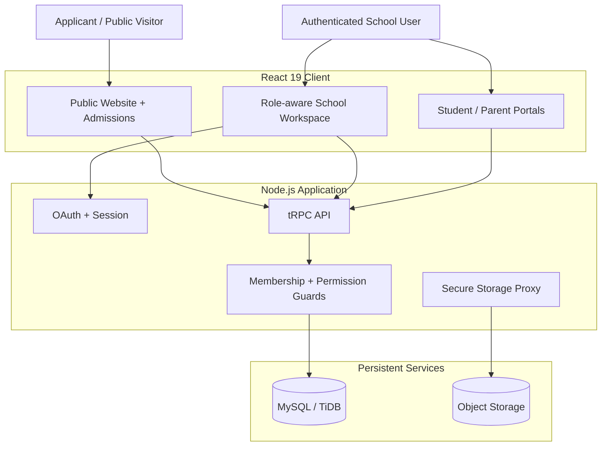

# NSOS — Nigerian School Operating System

> **The operating system for running a modern Nigerian school.**
>
> NSOS brings admissions, students, academics, attendance, results, finance, staff operations, communication, and a school's public digital presence into one secure, multi-tenant platform.

[](https://www.typescriptlang.org/)
[](https://react.dev/)
[](https://nodejs.org/)
[](https://trpc.io/)
[](https://orm.drizzle.team/)
[](https://vitest.dev/)
[](LICENSE)

---

## Why NSOS exists

Many schools operate through disconnected tools: spreadsheets for fees, paper registers for attendance, messaging apps for communication, separate portals for admissions, and manual processes for results and reporting.

NSOS is designed around a different model:

**one school → one operational system → one source of truth.**

The goal is not simply to digitize paperwork. NSOS provides the operational layer that connects the people, workflows, data, permissions, and public-facing services required to run a school.

### Built for Nigeria first

NSOS is configured for the Nigerian operating environment out of the box:

- **NGN** as the default currency
- **Africa/Lagos** as the default timezone
- Nigerian states and the FCT in onboarding
- Admissions and guardian workflows designed around school realities
- Finance workflows for fees, invoices, payments, balances, and receipts
- Provider configuration for Nigerian and international payment/notification services
- School-owned public websites and custom domains

---

## Product surface

NSOS is organized around the complete school lifecycle.

| Domain | What NSOS handles |
| --- | --- |
| **Admissions** | Public applications, documents, review, decisions, and enrollment handoff |
| **Students** | Student profiles, guardians, enrollments, academic history, promotion, graduation |
| **Academics** | Sessions, terms, classes, subjects, timetables, lesson plans, curriculum milestones |
| **Attendance** | Student and staff registers, absence tracking, summaries, alerts, exports |
| **Results** | Assessments, scores, grade scales, calculations, approvals, publications, report cards |
| **Finance** | Fee structures, invoices, invoice lines, payments, receipts, balances, reporting |
| **Staff & HR** | Departments, staff profiles, duties, leave, payroll records, performance notes |
| **Communication** | Announcements, targeted messages, delivery history, notification providers |
| **School Website** | Public school pages, admissions configuration, publishing, branding, custom domains |
| **Administration** | Tenant membership, roles, permissions, provider configuration, operational controls |

---

## Architecture

NSOS follows a deliberately explicit architecture: the client handles presentation and interaction; typed server procedures own business operations; authorization is evaluated on the server; persistent state is tenant-scoped; files live in object storage.



### Core technology

- **Frontend:** React 19, Vite, Tailwind CSS, Radix UI, Framer Motion
- **Application server:** Node.js, Express 4
- **API:** tRPC 11 with typed client/server contracts
- **Validation:** Zod
- **Database:** MySQL / TiDB
- **ORM & migrations:** Drizzle ORM + Drizzle Kit
- **Authentication:** OAuth-backed session context
- **Object storage:** S3-compatible storage
- **Testing:** Vitest
- **Build:** Vite + esbuild
- **Package manager:** pnpm

---

## Multi-tenant by design

A school is a first-class tenant in NSOS.

`schools.id` is the tenant boundary. Operational records carry the relevant `schoolId`, while `schoolMemberships` connects authenticated users to the schools they are allowed to operate.

The important architectural rule is:

> **Tenant isolation is a server-side security property, not a frontend filtering trick.**

Every private operation is expected to establish the user's active school membership and evaluate the required permission before accessing tenant-owned data.

### Role model

| Role | Primary responsibility |
| --- | --- |
| **Owner / Admin** | School-wide administration, memberships, reporting, website, domains, configuration |
| **Staff** | Operational workflows and assigned school processes |
| **Teacher** | Attendance, academic planning, assessments, and results |
| **Finance** | Fees, invoices, payments, receipts, and finance reporting |
| **Parent / Guardian** | Linked learner information, fees, attendance, published results, announcements |
| **Student** | Own permitted academic records and school communications |

Authorization is enforced by server procedures. UI visibility is not treated as an access-control boundary.

---

## Operational architecture

NSOS currently models the school around major operational domains rather than isolated screens.

```text
Public visitor
     │
     ├── Admissions ──> Application ──> Review ──> Decision ──> Enrollment
     │
     └── School website ──> Published school information

School workspace
     │
     ├── Students ──> Classes ──> Attendance
     │                  │
     │                  └──> Assessments ──> Results ──> Approval ──> Publication
     │
     ├── Finance ──> Fees ──> Invoices ──> Payments ──> Balances / Receipts
     │
     ├── Staff ──> Duties / Leave / Payroll / Performance
     │
     └── Communication ──> Announcements / Notifications / Delivery logs
```

This domain model makes NSOS suitable for incremental expansion without turning every new feature into an independent subsystem.

---

## Public school websites & custom domains

Every school can operate a branded public presence from its NSOS workspace.

The custom-domain flow is intentionally explicit:

1. An owner/admin saves a valid domain.
2. NSOS generates a verification token.
3. The school publishes the required TXT record at `_nsos-verify.<domain>`.
4. NSOS resolves the record and compares the value exactly.
5. The domain becomes active only after successful verification.
6. The managed hosting platform binds the verified domain for external traffic.
7. Public serving requires the domain to be both **verified and published**.

DNS ownership verification is therefore separated from platform domain binding. One proves control of the domain; the other routes traffic to the application.

---

## Provider integrations

NSOS is structured to support tenant-specific payment and notification providers without exposing provider credentials to the browser.

Supported configuration surfaces include:

- Paystack
- Flutterwave
- Stripe
- Manual payment confirmation
- Termii
- Twilio
- Resend
- SendGrid
- WhatsApp Cloud
- In-app notifications

Provider credentials are stored server-side in protected configuration. Dashboard reads expose readiness and non-secret metadata rather than raw credentials.

### SMS delivery integrity

For supported SMS providers, NSOS uses provider-specific signed callbacks and tenant-scoped message identifiers for delivery updates.

The design principle is important:

**`submitted` is not the same thing as `delivered`.**

NSOS records provider submission separately from confirmed delivery and protects terminal delivery states against replayed or out-of-order callbacks.

---

## Engineering principles — OAE standard

NSOS follows the engineering discipline used across the OAE ecosystem: systems should be understandable, testable, observable, secure, and capable of being changed without guessing.

### 1. One source of truth

Business state belongs in explicit domain models and persistence layers. Do not create hidden parallel state in UI components or process memory.

### 2. Server-side authority

Authentication, tenant boundaries, permissions, and sensitive business rules belong on the server.

### 3. Every feature must be testable

A feature is not considered complete merely because the interface renders. Its validation, authorization, business rules, failure paths, and critical integrations should be testable.

### 4. Security before convenience

Secrets stay server-side. Tenant boundaries are explicit. Sensitive actions require appropriate roles. Public endpoints are deliberately narrow.

### 5. Deterministic change

Schema changes require reviewed migrations. Large or destructive database operations require deliberate review rather than accidental deployment.

### 6. Observable operations

External operations should produce meaningful states and audit information. A provider request that was accepted by an API must not automatically be represented as successfully delivered.

### 7. No fabricated data

A newly created school starts empty. NSOS must not invent students, guardians, staff, applications, fees, or contact details to make the interface look populated.

### 8. Verify before declaring done

The engineering loop is:

```text
Plan
  ↓
Implement
  ↓
Typecheck
  ↓
Test
  ↓
Build
  ↓
Verify critical flows
  ↓
Review security / tenant boundaries
  ↓
Release
```

---

## Repository structure

```text
.
├── client/                 # React application and UI
├── server/                 # Express, tRPC, domain and service logic
│   ├── _core/              # Runtime, OAuth, context and platform services
│   └── routers/            # Typed API procedures
├── drizzle/                # Database schema and migrations
├── docs/                   # Architecture, deployment and operational docs
├── .github/workflows/      # CI automation
├── components.json         # UI component configuration
├── drizzle.config.ts       # Drizzle configuration
├── package.json            # Scripts and dependencies
├── LIVE_QA_GUIDE.md        # Live verification guide
├── SECURITY.md             # Security policy
└── README.md               # System overview and engineering entry point
```

---

## Local development

### Prerequisites

- Node.js 22+
- pnpm 10+
- A MySQL/TiDB-compatible database for persistence
- Required authentication/storage environment variables for the features being exercised

### Install

```bash
corepack enable
pnpm install --frozen-lockfile
```

### Configure environment

Create a local environment configuration appropriate to your deployment and provide the required database, identity, storage, and application secrets.

**Never commit secrets or production credentials.**

### Start development

```bash
pnpm dev
```

### Validate the system

```bash
pnpm check
pnpm test
pnpm build
```

### Production start

```bash
pnpm start
```

---

## Engineering commands

| Command | Purpose |
| --- | --- |
| `pnpm dev` | Start the development server with Vite middleware |
| `pnpm check` | TypeScript validation without emitting files |
| `pnpm test` | Execute the Vitest suite |
| `pnpm build` | Build the client and production server bundle |
| `pnpm start` | Start the production server |
| `pnpm format` | Format the repository with Prettier |
| `pnpm db:push` | Generate and apply Drizzle migrations |

For schema changes, review generated SQL before applying it. Treat destructive changes as high-risk operations.

---

## CI / release gate

The repository CI workflow is designed around a simple engineering contract:

```text
Install locked dependencies
        ↓
Typecheck
        ↓
Test
        ↓
Production build
```

The workflow lives at `.github/workflows/ci.yml`.

The intended release gate is **green typecheck + green tests + successful production build**. A passing build alone is not sufficient evidence that a change is safe.

---

## Security model

Security-sensitive areas are treated as architecture, not documentation afterthoughts.

Current controls include:

- Tenant-scoped persistence
- Active membership checks
- Server-side role and permission enforcement
- Protected provider configuration
- Sanitized provider reads
- Signed provider callbacks where supported
- Public endpoint restrictions
- Browser/security headers
- No-store behavior for sensitive API responses
- Bounded request parsing
- Same-origin mutation protection
- Route-sensitive database request throttling

See [`SECURITY.md`](SECURITY.md) for the project's security policy.

If you discover a security issue, do not disclose exploitable details in a public issue. Follow the security reporting process defined in the repository policy.

---

## Documentation

- [`docs/NSOS_ARCHITECTURE_AND_DEPLOYMENT.md`](docs/NSOS_ARCHITECTURE_AND_DEPLOYMENT.md) — architecture, deployment, tenant isolation, domains, providers, and operational controls
- [`LIVE_QA_GUIDE.md`](LIVE_QA_GUIDE.md) — live QA and verification workflow
- [`SECURITY.md`](SECURITY.md) — security policy and reporting guidance

The README is the orientation layer. Detailed implementation decisions belong in the technical documentation.

---

## Project status

**Development status: active engineering / production hardening.**

NSOS already has a substantial application foundation, including multi-tenant architecture, role-aware workflows, admissions, academics, attendance, results, finance, staff operations, communication, public websites, custom-domain verification, provider configuration, and automated validation infrastructure.

The project remains under active engineering. Production readiness is treated as a verification problem rather than a marketing label: critical workflows, integrations, security boundaries, deployment behavior, and operational failure modes must continue to be validated as the system evolves.

---

## Design philosophy

NSOS is not intended to be another collection of dashboards.

It is being built as **school infrastructure**.

That means the system should answer operational questions reliably:

- Who is allowed to see this data?
- Which school owns this record?
- What happened to this application?
- Has this result actually been approved and published?
- How much has this invoice been paid?
- Was that notification submitted or actually delivered?
- Who changed the configuration?
- Can the operation be reproduced and tested?
- What happens when the external provider fails?

If the system cannot answer those questions, the feature is not finished.

---

## Contributing

Contributions should preserve the project's core engineering constraints:

1. Keep tenant boundaries explicit.
2. Keep authorization on the server.
3. Validate inputs at system boundaries.
4. Add tests for meaningful business behavior.
5. Prefer small, reviewable changes.
6. Review database migrations before applying them.
7. Do not commit secrets or generated production data.
8. Run `pnpm check`, `pnpm test`, and `pnpm build` before treating a change as release-ready.

For larger architectural changes, document the decision and its operational consequences before implementation.

---

## License

NSOS is licensed under the [MIT License](LICENSE).

---

<div align="center">

**NSOS — Nigerian School Operating System**

*One school. One operational system. One source of truth.*

</div>
