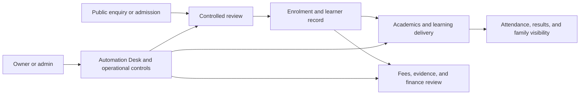
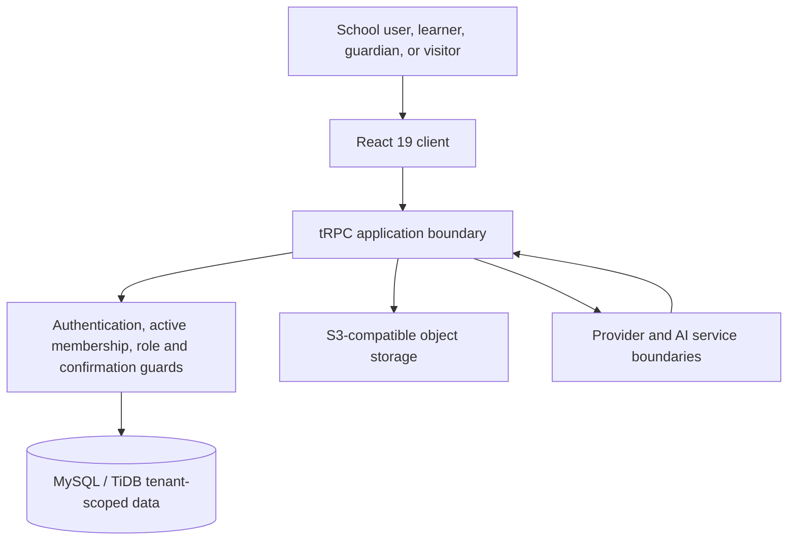

# NSOS — Nigerian School Operating System

> **A Nigeria-first operating system for schools and learning businesses that need to move from fragmented administration to controlled, AI-assisted learning operations.**

[](https://www.typescriptlang.org/)
[](https://react.dev/)
[](https://nodejs.org/)
[](https://trpc.io/)
[](https://orm.drizzle.team/)
[](https://vitest.dev/)

**[Live managed preview](https://nsos-system-uhkdscaf.manus.space)** · **[Architecture](docs/NSOS_ARCHITECTURE_AND_DEPLOYMENT.md)** · **[Security](SECURITY.md)** · **[Product roadmap](docs/NSOS_PRODUCT_DIFFERENTIATION_ROADMAP.md)** · **[Learning Centre operating model](docs/learning-centre-of-excellence-operating-model.md)**

---

## Investment thesis

NSOS is built around a straightforward observation: education operators do not experience admissions, collections, learning delivery, parent trust, staffing, and public visibility as separate software categories. They experience them as one operating problem.

The platform combines a multi-tenant operations core with a supervised learning and automation layer. An owner can run independent institutions from one account, including conventional schools, vocational institutes, coaching centres, online training providers, and hybrid operators. Every workspace remains isolated at the server boundary, while each organisation can choose the workflows it is ready to operate.

| What an operator needs | NSOS response | Why it matters commercially |
|---|---|---|
| A controlled route from enquiry to active learner | Admissions, review, enrolment, student/guardian records, academics, attendance, results, and family portals | Replaces fragmented operational handoffs with a traceable lifecycle. |
| Visibility into school cash and family confidence | Fee structures, invoices, payment evidence review, promises, statements, controlled finance drafts, and family-facing status | Creates a practical operating wedge around cash visibility and reliable parent information. |
| A credible route into new learning offers | Programmes, cohorts, internal curriculum, milestones, materials, attendance, and human-reviewed learning progress | Lets education operators extend beyond a static school-management workflow into repeatable learning delivery. |
| A simpler way to start | Automation Desk, Quick Start, Course Studio, and the 19-prompt Taster Library | Reduces setup friction without pretending that high-impact actions can be safely automated. |
| Trust as an operational property | Tenant isolation, server-side role checks, confirmations, rate limits, audit evidence, protected provider settings, and safe file handling | Makes control and accountability part of the product architecture rather than an afterthought. |

## The product in one sentence

**NSOS gives education operators one controlled workspace to organise people, learning, payments, communications, and digital presence—then uses supervised AI to reduce setup time without removing human accountability.**

---

## The problem NSOS is designed to solve

Many institutions still coordinate daily operations across paper registers, spreadsheets, payment conversations, chat groups, disconnected admission forms, and ad-hoc websites. That creates a familiar set of operational failures: unclear ownership, delayed follow-up, weak visibility, duplicated records, inconsistent family communication, and difficult expansion into new learning offers.

NSOS does not position itself as another dashboard. It is designed as the operating layer that joins workflows, data, permissions, evidence, and human decisions across the institution lifecycle.



---

## Product surface

### Core school operations

| Domain | Delivered operational scope |
|---|---|
| **Admissions and onboarding** | Public admission intake, document handling, controlled review, decisions, enrolment handoff, admission letters, and guardian linkage. |
| **Student and family operations** | Student profiles, guardian relationships, biodata, local draft recovery, parent/guardian portal, fee and payment-evidence visibility, statements, and status tracking. |
| **Academics** | Sessions, terms, classes, subjects, Nigerian curriculum foundations, schemes of work, lesson planning, attendance, assessments, score workflows, approvals, and result publication controls. |
| **Finance operations** | Fee structures, invoices, balances, payments, receipts, payment promises, evidence review, and controlled inactive fee-draft preparation. |
| **People operations** | Staff records, roles, duties, leave, performance notes, invitation preparation, and migration workflows. |
| **Communication and provider readiness** | Announcements, in-app communication, delivery-state modelling, provider configuration, test controls, and provider callback boundaries. |
| **School presence** | Owner-reviewed website drafts, approved media, visual themes, live preview, controlled publication, and custom-domain readiness. |

### Learning Centre of Excellence

NSOS now supports school, vocational, coaching, online-training, and hybrid operators through a common learning-operations model. Owners and administrators can manage programmes, cohorts, instructor assignments, internal programme fees, attendance, curriculum modules, milestones, materials, and reviewed learner progress. Course designers can choose a small curated evidence library, record tenant-owned planning references, and specify a transparent pace/support/practice profile for an editable internal draft. Institutions can separately create and activate a private issuer policy, then issue a private record only after human-confirmed programme completion, reviewed active milestones, evidence summary, and a final confirmation. Learners see only their own permitted programme state. NSOS does not claim accreditation or curriculum approval, automatically complete learners, publish courses, enrol people, issue publicly verified credentials, or create commercial transactions. See the [Learning Centre operating model](docs/learning-centre-of-excellence-operating-model.md) and [curated learning and private certification operating model](docs/curated-learning-and-private-certification-operating-model.md).

### AI-assisted operating layer

| Capability | What it does | What it intentionally does not do |
|---|---|---|
| **Enterprise Concierge** | Turns a bounded operational prompt into role-aware guidance and a protected handoff. | Perform a high-impact action from chat. |
| **Automation Desk** | Creates typed jobs from plain language, asks for only missing approved data, records progress, and runs eligible internal steps after one explicit approval. | Send messages, publish content, activate fees, connect providers, create accounts, collect money, or issue credentials. |
| **Course Studio** | Generates an editable internal programme, module, milestone, material, tutor-scope draft, and transparent learning-experience profile using optional server-resolved curated references. | Claim curriculum approval/accreditation, launch a public course, or create learner outcomes without review. |
| **Private issuer records** | Lets an institution separately draft and activate a programme policy, then create one tenant-private evidence-backed record after human completion and milestone review. | Represent a record as accreditation, a professional qualification, a public credential, or publicly verified certificate. |
| **Single-Prompt Online School Launcher** | Creates one private, draft-only online-learning foundation and configuration-readiness record from a full owner prompt. | Create mock people, testimonials, payments, public content, tutor accounts, credentials, or revenue. |
| **19-Prompt Taster Library** | Provides one-tap course-launch prompts across digital, creative, business, trade, STEM, enterprise, and academic-support niches. | Make claims of demand, pricing, sales, accreditation, outcomes, or public availability. |

The AI boundary is a product advantage: models produce strict structured plans and drafts; server-side code validates all inputs, owns the action catalog, and executes only allowlisted internal work. The system keeps human review where consequences become financial, public, identity-related, or irreversible. See the [supervised AI operating model](docs/supervised-ai-agents-operating-model-2026-08-22.md) and [single-prompt launcher contract](docs/single-prompt-online-school-launcher-contract.md).

---

## Why the automation model matters

NSOS is designed to make setup materially simpler without creating a black-box automation risk. The owner journey is deliberately short:

> **Describe a goal → review the plan → approve one bounded run → inspect durable evidence.**

The Automation Desk is not a generic chat assistant. It has a durable job lifecycle, server-enforced membership and role checks, rate limits, idempotency, safe audit events, explicit failure states, and honest recovery steps. The job runner is intentionally limited to safe, internal actions. This supports a strong user experience while preserving a credible trust model for institutional data. See the [Automation Desk operating model](docs/automation-desk-operating-model.md).

---

## Commercial design

NSOS is currently a private software project. This repository does **not** represent customer count, revenue, retention, fundraising, valuation, accreditation, growth, or financial performance.

The product is designed around several commercial surfaces that can be validated with real operators over time:

| Potential commercial surface | Product basis today | Commercial validation still required |
|---|---|---|
| Institution subscription | Multi-tenant school and learning-operator workspaces, operational controls, and role-based portals | Packaging, price discovery, billing terms, support model, and willingness-to-pay evidence. |
| Learning-centre expansion | Programmes, curriculum, internal materials, cohort operations, and controlled progress review | Buyer adoption, delivery economics, and programme-level retention. |
| AI setup and course acceleration | Automation Desk, Course Studio, single-prompt private launcher, and 19-prompt tasters | Usage frequency, conversion into paid workflows, quality-review operations, and model-cost discipline. |
| Branded digital presence | Review-first school websites, approved media, themes, custom-domain readiness, and advertising preparation | Public-launch adoption, domain/provider activation, and managed-service economics. |
| Communication and payment ecosystem | Provider configuration surfaces and controlled finance/communication workflows | Verified sender domains, provider onboarding, compliant commercial agreements, and production delivery evidence. |

This separation is intentional: the README shows the product architecture and commercial direction, not fabricated traction.

---

## Architecture and technical diligence

NSOS uses a typed, full-stack web architecture with a server-authoritative trust model.



| Layer | Technology and responsibility |
|---|---|
| **Client** | React 19, Vite, Tailwind CSS, Radix UI, and typed tRPC queries/mutations. |
| **Application** | Node.js, Express 4, tRPC 11, Zod validation, and server-side domain procedures. |
| **Persistence** | MySQL/TiDB-compatible schema managed through Drizzle ORM and reviewed additive migrations. |
| **Identity and authorisation** | OAuth-backed sessions, active membership checks, role checks, confirmation gates, and route-level rate limits. |
| **Storage** | S3-compatible object storage for file bytes; database records store scoped metadata and references. |
| **Quality controls** | Vitest, TypeScript validation, production builds, focused security/tenant regressions, and documented operational checks. |

### Multi-tenant by design

The tenant boundary is `schools.id`. Operational records are scoped by `schoolId`, and `schoolMemberships` defines who may access each institution. One authenticated owner can create and switch among independent institution workspaces, but a client-side selection never grants access: each protected server procedure rechecks membership and role.

> **Tenant isolation is enforced on the server. It is not a frontend filtering convention.**

### Security posture

The security model prioritises controlled action over superficial convenience. Core controls include tenant-scoped persistence, active membership checks, server-side authorisation, confirmation gates for consequential changes, rate limits, privacy-safe security audit events, protected provider configuration, file-signature validation, signed callback boundaries where supported, and no-store handling for sensitive responses.

Detailed security information is available in [SECURITY.md](SECURITY.md), [architecture and deployment documentation](docs/NSOS_ARCHITECTURE_AND_DEPLOYMENT.md), and [security/compliance review notes](docs/security-compliance-review-notes.md).

---

## Evidence and current release status

The product is in **active engineering and controlled rollout preparation**. The repository contains real product code, reviewed migrations, regression coverage, and managed deployment checkpoints. It does not represent a claim that every external provider is live or that commercial readiness has been completed.

| Evidence category | Current repository record |
|---|---|
| Managed preview | [NSOS managed preview](https://nsos-system-uhkdscaf.manus.space) is available; normal authentication and workspace setup apply. |
| Latest product additions | Automation Desk, Quick Start, Course Studio, Single-Prompt Online School Launcher, and the 19-Prompt Taster Library. |
| Focused validation | The most recent Taster Library release passed 11 focused tests across 3 files, TypeScript validation, a production build, and managed-shell rendering. |
| Broader regression record | The last full-suite record before the taster-only UI/library addition was 336 passing tests across 97 files, with one external sender-domain authorization failure. |
| Known external dependency | Branded sender activation remains blocked until compliant `nsos.ng` registration and Resend sender verification are resolved. No payment, DNS, domain, or sender change is made without written terms and explicit approval. |

The visible external dependency is documented rather than hidden. See [communication reliability and email-service plan](docs/communication-reliability-and-email-service-plan-2026-08-22.md) and the [DomainKing decision record](docs/domainking-invoice-410679-status-2026-08-22.md).

---

## Diligence starting points

| Topic | Repository reference |
|---|---|
| Product architecture and deployment | [NSOS Architecture and Deployment](docs/NSOS_ARCHITECTURE_AND_DEPLOYMENT.md) |
| Product differentiation and buyer logic | [Product Differentiation Roadmap](docs/NSOS_PRODUCT_DIFFERENTIATION_ROADMAP.md) |
| Revenue foundations and commercial controls | [Revenue Foundation](docs/NSOS_REVENUE_FOUNDATION.md) |
| Learning operating model | [Learning Centre of Excellence](docs/learning-centre-of-excellence-operating-model.md) |
| AI and automation operating model | [Supervised AI Agents](docs/supervised-ai-agents-operating-model-2026-08-22.md) and [Automation Desk](docs/automation-desk-operating-model.md) |
| Single-prompt and taster products | [Online School Launcher](docs/single-prompt-online-school-launcher-contract.md) and [Taster Library](docs/online-school-taster-library-operating-model.md) |
| Security policy | [SECURITY.md](SECURITY.md) |
| Repository entity record | [NSOS Entity Card](docs/nsos-entity-card.md) |

---

## Roadmap discipline

The roadmap is deliberately driven by proof, safety, and operational utility rather than superficial feature count.

| Horizon | Direction | Gate before broader rollout |
|---|---|---|
| **Now** | Validate multi-tenant operations, learning workflows, AI-assisted setup, migration controls, and the 19-prompt taster experience with real owner review. | Stable tenant boundaries, trusted workflows, and clear support feedback. |
| **Next** | Deepen instructor delivery, guardian visibility policy, evidence uploads, selected background rules, and commercial packaging. | Explicit owner controls, privacy review, reliable delivery evidence, and clear operational recovery. |
| **Later** | Add selected verified provider activation, public launch paths, and commercial expansion features where customer evidence supports them. | Written provider/domain terms, verified senders, live-service testing, and approved commercial policy. |

This is direction, not a timetable or performance forecast.

---

## Local development

### Prerequisites

- Node.js 22+
- pnpm 10+
- A MySQL/TiDB-compatible database
- Appropriate identity, storage, and application environment variables for the features being exercised

### Install and run

```bash
corepack enable
pnpm install --frozen-lockfile
pnpm dev
```

### Validate before a release

```bash
pnpm check
pnpm test
pnpm build
```

| Command | Purpose |
|---|---|
| `pnpm dev` | Start the development server. |
| `pnpm check` | Run TypeScript validation without emitting files. |
| `pnpm test` | Run the Vitest regression suite. |
| `pnpm build` | Produce the production client and server bundle. |
| `pnpm start` | Start the production server bundle. |
| `pnpm db:push` | Generate and apply Drizzle migrations; review generated SQL before applying it. |
| `pnpm format` | Apply Prettier formatting. |

Never commit secrets, production credentials, or synthetic personal records. File bytes belong in object storage, not database columns. Any schema change must use a reviewed migration.

---

## Contributing and repository standards

Contributions should preserve the properties that make NSOS suitable for institutional operations:

1. Keep tenant boundaries explicit and server-enforced.
2. Keep role checks, confirmation gates, and consequential actions on the server.
3. Use tRPC for client/server product interactions.
4. Add meaningful regression coverage for new business behaviour and safety boundaries.
5. Review generated database SQL before it is applied.
6. Keep AI output structured, bounded, and subordinate to allowlisted server actions.
7. Do not fabricate people, testimonials, learner outcomes, revenue, credentials, payment activity, or public claims.
8. Run type checks, tests, and a production build before treating a change as release-ready.

---

## Repository status

**Private repository · Active engineering · Controlled rollout preparation**

NSOS is being built as durable education infrastructure: a platform that becomes more valuable as an institution centralises approved operational state, while still allowing people to understand, review, and control every consequential action.
