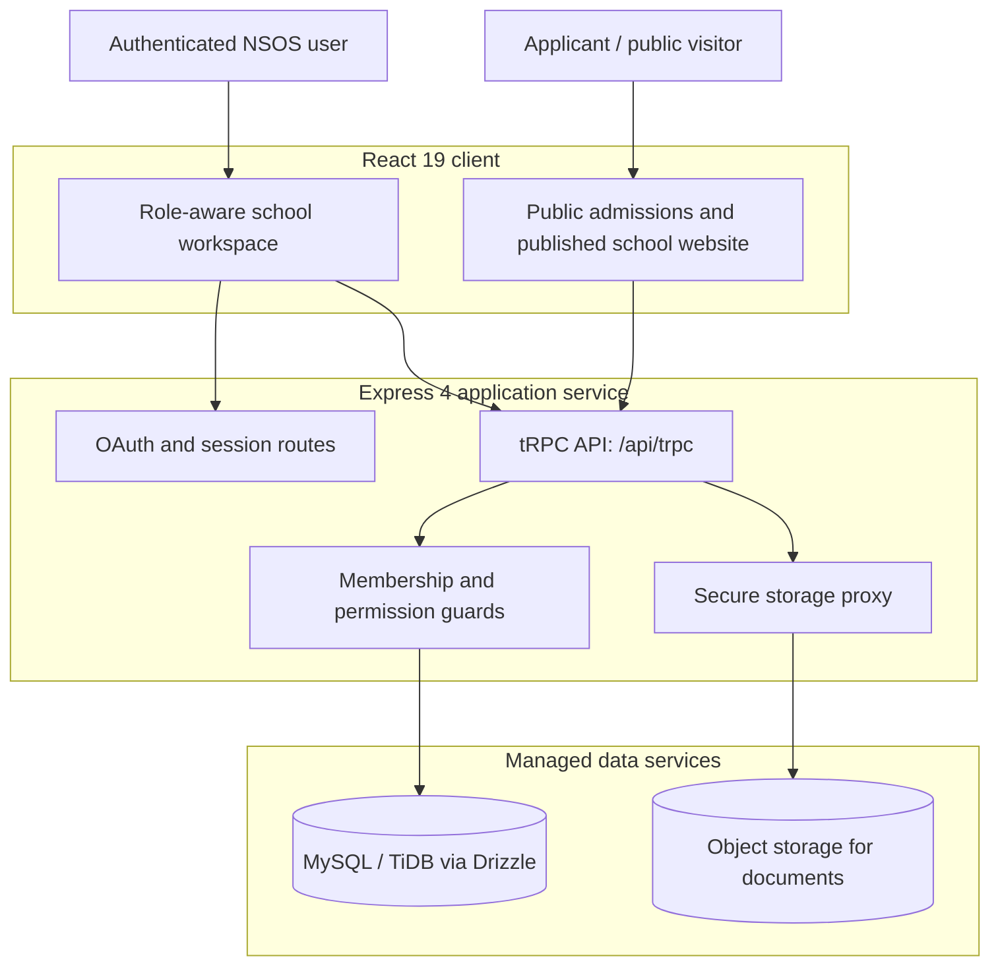
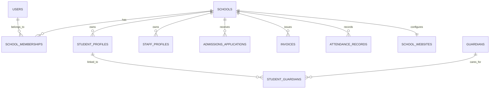

# NSOS Multi-Tenant Architecture and Deployment

**System:** NSOS — Nigerian School Operating System  
**Architecture basis:** Implemented React, Express, tRPC, Drizzle, and MySQL/TiDB application  
**Document purpose:** Technical handover, deployment reference, and tenant rollout guide

## 1. Architecture summary

NSOS is a **multi-tenant school operating system**. Each school is an isolated tenant represented by a `schools` record. Every operational record is associated with a school context, and server-side procedure guards enforce active membership and permission checks before private data can be read or changed.

The platform is designed for Nigeria-first configuration: new school records default to **NGN** and **Africa/Lagos**, while the onboarding UI presents Nigerian states and the FCT. Each tenant begins empty; NSOS does not fabricate students, guardians, staff, fees, applications, or contact details.



| Layer | Implemented responsibility | Key implementation locations |
|---|---|---|
| Client | Public pages, onboarding, responsive role-aware workspace, portal views, website studio | `client/src/pages/`, `client/src/components/` |
| API | Typed queries and mutations, input validation, authorization | `server/routers/nsos.ts`, `server/routers.ts` |
| Domain/service | Persistence helpers, grade calculations, domain/DNS logic, data aggregation | `server/db.ts`, `server/grade-calculations.ts`, `server/roles.ts` |
| Identity | OAuth-backed authenticated context and cookie session | `server/_core/oauth.ts`, `server/_core/context.ts` |
| Data | Tenant-scoped relational model and migrations | `drizzle/schema.ts`, `drizzle/migrations/` |
| Files | S3-backed storage references for admissions documents | `server/storage.ts`, `server/_core/storageProxy.ts` |

## 2. Multi-tenant model

### Tenant boundary

`schools.id` is the tenant key. Most business tables carry `schoolId`, including admissions, learners, classes, attendance, assessments, invoices, payments, staff records, messages, and website configuration. The user-to-tenant relationship resides in `schoolMemberships`, where the unique `(schoolId, userId)` pair prevents duplicate membership records.

The application does not rely on client-side filtering as a security control. Procedures receive `schoolId`, obtain the user’s membership, verify that the membership is active, and evaluate the role permission before calling a tenant-scoped helper. The core procedure guard rejects unavailable workspaces and unauthorized actions with `FORBIDDEN`.



### Roles and access boundaries

| Role | Primary working area | Important restrictions |
|---|---|---|
| Owner / admin | All school operations, reporting, memberships, public website, custom domain | Website publishing and DNS verification are restricted to these management roles. |
| Staff | Operational work and assigned processes | No unrestricted finance, public-site, or cross-school control. |
| Teacher | Attendance, academic planning, assessments, results | Cannot manage finance or public website configuration. |
| Finance | Fee structures, invoices, payments, receipts, finance reporting | Cannot manage the public website or academic records beyond necessary finance views. |
| Parent / guardian | Linked ward attendance, published results, fees, announcements | Cannot view other families’ data. |
| Student | Own published records and announcements | Cannot view other learners’ records. |

> Authorization is enforced in server procedures rather than only by hiding navigation items. The school website and custom-domain APIs require an active **owner or administrator** membership.

## 3. Operational data domains

The implemented schema contains 35 tables. The table groups below provide the primary operational vocabulary for integrations, reporting, and future schema extensions.

| Domain | Tables | Operational outcome |
|---|---|---|
| Tenant and identity | `users`, `schools`, `schoolMemberships`, `schoolWebsites`, `providerConfigurations` | Isolated school workspaces, access roles, public school configuration, verified domains, and provider settings |
| Admissions | `admissionsApplications`, `admissionDocuments` | Public applications, document records, review states, enrollment handoff |
| Student lifecycle | `studentProfiles`, `guardians`, `studentGuardians`, `enrollments` | Profiles, guardian links, academic history, promotion, graduation |
| Academics | `academicSessions`, `academicTerms`, `classes`, `subjects`, `classSubjects`, `timetableEntries`, `lessonPlans`, `curriculumMilestones` | Academic structure, timetable, teaching plans, coverage tracking |
| Attendance | `attendanceRecords` | Student/staff registers, absence summaries, alerts, exports |
| Results | `assessments`, `gradeScales`, `scores`, `resultPublications` | Validated scores, grade computation, approval, publication, report cards |
| Finance | `feeStructures`, `invoices`, `invoiceLineItems`, `payments` | Fees, invoices, payments, receipts, balances, collection reporting |
| Staff | `departments`, `staffProfiles`, `staffDuties`, `leaveRequests`, `payrollRecords`, `performanceNotes` | Personnel structure and HR operations |
| Communication | `announcements`, `messageLogs` | Noticeboard, targeted in-app messages, delivery history |

## 4. Core business flows

### Admissions to enrollment

1. A family opens the public `/apply/:shortCode` route and submits an application.
2. The API resolves the school by short code and persists a school-scoped application.
3. Authorized school users review the application and attached documents.
4. Document review creates verified or rejected states with reviewer context.
5. An accepted application is enrolled into a learner profile and academic class record.

Public submission is intentionally narrow. Application review, document access, decisions, and enrollment remain in authenticated tenant procedures.

### Results release

1. Teachers or permitted academic users create assessments and enter validated scores.
2. Grade calculation resolves percentages and grade-scale results.
3. A management approval gate is recorded before a class result can be published.
4. Parent and student portals retrieve only formally published results linked to their permitted learner context.

### Fees and receipts

Fee structures generate invoices. Payment records reduce outstanding balances and can be represented through receipt output. Finance summaries aggregate invoiced, collected, and outstanding values at tenant scope.

## 5. Public website and custom-domain architecture

Each school may configure a branded public website in the protected **School website** workspace. Its publish toggle, admissions toggle, headline, introductory text, contact details, campus location, and primary colour are tenant configuration—not application source code.

```mermaid
sequenceDiagram
    participant Admin as Owner / Admin
    participant NSOS as NSOS Website Studio
    participant DNS as School DNS Provider
    participant Public as Public Visitor

    Admin->>NSOS: Save domain and publish settings
    NSOS->>NSOS: Normalise and validate host name
    NSOS->>NSOS: Generate verification token; status=pending
    Admin->>DNS: Add TXT _nsos-verify.domain
    Admin->>NSOS: Verify domain
    NSOS->>DNS: Resolve TXT record
    DNS-->>NSOS: Exact verification token
    NSOS->>NSOS: status=active
    Public->>NSOS: Request active custom domain
    NSOS->>NSOS: Serve site only if active AND published
```

The custom-domain lifecycle is enforced by three conditions:

| Stage | NSOS behavior |
|---|---|
| Input | The API accepts only a valid bare domain name; protocols and paths are rejected. |
| Ownership | NSOS generates a token. The school adds `nsos-site-verification=<token>` at `_nsos-verify.<domain>`. |
| Activation | NSOS resolves DNS and changes the domain to `active` only when the TXT value matches exactly. |
| Public serving | Host-based resolution returns a school website only when `domainStatus = active` and `published = true`. |

The school must additionally bind its verified domain to the managed deployment through the platform’s domain settings. DNS verification establishes ownership for NSOS; the managed domain binding directs external traffic to the application.

## 6. Deployment architecture

### Build and runtime

NSOS uses a unified Node.js service. During development, Express hosts the API and Vite supplies the client. During production, the same Express process serves the built static client and the tRPC API.

| Command | Purpose |
|---|---|
| `pnpm dev` | Run the TypeScript Express server with Vite development middleware. |
| `pnpm check` | Run TypeScript validation without emitting build files. |
| `pnpm test` | Run Vitest unit and route-level tests. |
| `pnpm build` | Build the Vite client and bundle the server to `dist/`. |
| `pnpm start` | Start the production server from `dist/index.js`. |
| `pnpm drizzle-kit generate` | Generate an additive schema migration. |
| `pnpm drizzle-kit migrate` | Apply registered migrations. |

The production build sequence is:

```text
React / Tailwind source ──Vite──> dist/public
Express / tRPC source  ──esbuild──> dist/index.js
dist/index.js + dist/public ──Node.js──> managed autoscale deployment
```

The server does not hardcode a production port. It reads `PORT`, falls back to 3000 locally, and selects an available port. All API traffic is mounted at `/api/trpc`; OAuth and the storage proxy are registered before the static/Vite serving layer.

### Managed hosting profile

The current project is deployed on the managed **Autoscale** profile. The runtime is a Node-based container service that can scale down when inactive. Design requests and background work accordingly: do not require an always-running worker, fixed IP address, local durable disk, or long-lived in-memory state.

| Deployment concern | NSOS approach |
|---|---|
| Stateless service | Persist operational state in database/object storage; do not rely on process memory. |
| File handling | Store document bytes in object storage and retain metadata or references in the database. |
| API routing | Keep service procedures behind `/api/trpc` for gateway routing. |
| Background work | Use managed scheduling/heartbeat patterns only when a future feature requires periodic work. |
| Custom domain | Bind the domain at the managed platform level after NSOS DNS verification. |

### Environment and secret handling

The managed environment provides the database, OAuth, storage, JWT, and platform integration variables. Do not commit `.env` files or hardcode credentials. Add or change secrets through the managed secret workflow and validate any updated integration with tests.

### Tenant provider configuration

Owners and administrators configure payment and notification providers directly from the command dashboard. The current interface supports Paystack, Flutterwave, Stripe, manual payment confirmation, Termii, Twilio, Resend, SendGrid, WhatsApp Cloud, and in-app-only notification delivery. Each tenant may retain one payment configuration and one notification configuration.

Credential values are encrypted server-side before persistence and are never returned in dashboard reads. The UI exposes only whether credentials are present, the provider’s draft/ready/disabled state, and non-secret configuration such as a public key, merchant reference, sender ID, or from address. Externally connected providers cannot be marked ready unless encrypted credentials are present. Adapter execution remains separately enabled by the payment or notification workflow that consumes the provider configuration.

Owner and administrator users can invoke **Test Connection** only after saving a provider configuration. The test decrypts credentials solely within the server process, performs a safe read-only provider request, and returns a sanitized success or failure message. It records the successful verification timestamp and does not create a payment or send a notification. Manual payment confirmation and in-app-only notifications report readiness locally because they do not require an external provider connection.

For SMS-capable **Termii** and **Twilio** notification configurations, the dashboard also exposes **Send test message**. It opens a confirmation modal that requires a specific phone number and an explicit authorization acknowledgement before a live SMS request can be sent. Nigerian `080…` numbers are normalized to international format, audit logs retain only a masked destination, and the server uses the encrypted provider credentials without returning them to the client. A test may consume the provider’s SMS credit but contains no learner or guardian data.

NSOS records a successful send request as **submitted with delivery pending**, not delivered. It stores the provider message identifier and presents a **Check delivery status** action. This queries the Termii message-history report or Twilio message resource, reporting confirmed delivery only when the provider returns `delivered`; failures update the audit state accordingly. Until then, the dashboard states that delivery has not been confirmed.

### Real-time SMS delivery callbacks

Automatic delivery reports are handled by two public, stateless `POST` routes that execute before authenticated APIs. A route receives no user session and updates no data until it verifies both the tenant selector and the provider signature. The handler then finds the matching SMS audit log by **school ID and provider message ID**, and performs a conditional transition from `queued` to `sent` or `failed`. Replayed, delayed, non-terminal, or out-of-order callbacks cannot downgrade a terminal record.

| Provider | School setup | NSOS callback behavior |
|---|---|---|
| Termii | Copy the dashboard callback URL to the Termii developer console and store Termii’s webhook signing secret in the protected provider configuration. | NSOS verifies `X-Termii-Signature` against the raw JSON payload using HMAC-SHA512. `Delivered` marks the log as sent; DND, failed, rejected, and expired statuses mark it failed. |
| Twilio | NSOS supplies the tenant callback URL as `StatusCallback` whenever it sends a Twilio SMS test. | NSOS verifies `X-Twilio-Signature` using the tenant Auth Token and the full callback URL plus form fields. `delivered` marks the log as sent; `failed` and `undelivered` mark it failed. |

The primary delivery-confirmation path therefore requires no persistent worker or periodic polling and remains compatible with the managed stateless deployment. The manual delivery check remains available as an operational fallback.

| Configuration category | Examples |
|---|---|
| Database | `DATABASE_URL` |
| Session and identity | `JWT_SECRET`, OAuth endpoint/application variables |
| Ownership | `OWNER_OPEN_ID`, `OWNER_NAME` |
| Platform integrations | Storage and built-in API endpoint/key variables |
| Client configuration | `VITE_*` public configuration variables provided by the deployment platform |

## 7. Schema change and release procedure

Follow this sequence for any change that affects persistence:

1. Update `drizzle/schema.ts` with the intended additive or carefully reviewed structural change.
2. Generate a migration with `pnpm drizzle-kit generate`.
3. Review the generated SQL. Treat drops, destructive alterations, and broad updates as high risk.
4. Apply the reviewed migration through the managed database operation, then record migration progress with `pnpm drizzle-kit migrate`.
5. Add or update database helper functions and tRPC procedures.
6. Add unit and route-level tests for policy, validation, and business behavior.
7. Run `pnpm check`, `pnpm test`, and `pnpm build`.
8. Check key desktop and mobile routes visually, review the delivery tracker, then save a release checkpoint.

## 8. Security, privacy, and continuity controls

| Risk area | Current control | Operational recommendation |
|---|---|---|
| Cross-school access | Tenant-scoped schema plus active membership and permission checks | Add automated regression tests whenever a new tenant-owned domain is introduced. |
| Role escalation | Owner/admin-only procedures for membership and public website/domain actions | Review memberships during school onboarding and staff offboarding. |
| Provider credential exposure | Owner/admin-only provider APIs, server-side encrypted credential storage, sanitized dashboard reads | Do not paste provider secrets into browser-visible documentation or client configuration. |
| SMS callback spoofing | Provider-specific signed callback validation, tenant-scoped message lookup, constant-time signature comparison, and terminal-state protection | Register only the copied tenant callback URL and rotate provider secrets if compromise is suspected. |
| Public data exposure | Public routes return only admissions and published website configuration | Keep operational reporting, documents, and portal records behind authentication. |
| Result privacy | Parent/student portal retrieval is restricted to the relevant learner and published results | Verify guardian links before enabling a family account. |
| Document storage | Object storage references rather than database file bytes | Define retention and deletion policy with each school. |
| Domain takeover | DNS TXT ownership verification plus active status gate | Rotate the verification token whenever a domain changes. |
| Deployment recovery | Saved application checkpoints and database migrations | Maintain a documented external data export and recovery cadence for each tenant. |

## 9. Tenant rollout runbook

1. Create an empty school workspace with school name, code, and Nigerian state.
2. Configure session, term, class levels, subjects, grading scale, fee structures, and staff roles.
3. Invite internal users and validate each role with authorized test accounts before using family data.
4. Configure public admissions and the school website only after the school approves published content.
5. If a custom domain is required, save it in Website Studio, add the TXT record, bind the domain through platform settings, and verify it in NSOS.
6. Import or create real records only through authorized school channels and confirm portal access links are correct.
7. For Termii, copy the provider callback URL into the Termii developer console and save its webhook signing secret in the protected notification configuration. For Twilio, retain the configured Auth Token so NSOS can validate its automatic delivery callback.
8. Send an authorized test SMS and confirm that its audit status changes from pending to delivered or failed after the provider report. Use manual delivery check only if the callback cannot be configured.
9. Monitor attendance, admissions, invoice, payment, and results workflows during the first term.

## 10. Validation evidence

The current release was validated using the following application checks:

| Validation | Result |
|---|---|
| TypeScript validation | Passed via `pnpm check` |
| Automated tests | 37 Vitest tests passed, covering policy, grading, public admissions, operations, finance/staff, domains, provider security, SMS delivery signatures, and terminal-state rules |
| Production build | Passed via `pnpm build` |
| Visual review | Desktop and mobile onboarding plus public unpublished-site privacy state reviewed |
| Change control | Release checkpoint saved after completion |

## 11. Reference implementation locations

| Topic | Source locations |
|---|---|
| Runtime/build scripts | `package.json` |
| Server request pipeline | `server/_core/index.ts` |
| Signed SMS delivery callbacks | `server/webhooks.ts`, `server/db.ts`, `server/routers/nsos.ts` |
| Tenant schema | `drizzle/schema.ts` |
| Role and tenant procedure guards | `server/routers/nsos.ts`, `server/roles.ts` |
| Data access and DNS verification | `server/db.ts` |
| Public admissions | `client/src/pages/PublicAdmissions.tsx`, `server/routers/nsos.ts` |
| Public school site and domain routing | `client/src/pages/SchoolWebsite.tsx`, `client/src/pages/DomainSchoolWebsite.tsx`, `client/src/components/WebsiteStudio.tsx` |
| Automated tests | `server/*.test.ts` |

---

**Document status:** Exported from the implemented NSOS release. Review this document alongside the tenant’s institutional policies for payments, data retention, student safeguarding, and communication approval.
